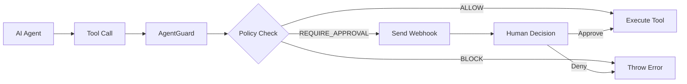

# @zamoore/agentguard-node

A security toolkit that gives developers control over their AI agents by intercepting and governing tool calls with declarative policies.

## Overview

**AgentGuard is not another agent framework** — it's a specialized governance layer that makes existing agents safer through declarative policy management.

When an AI agent wants to call an API, access a database, or perform any action, AgentGuard instantly evaluates that action against your policies and decides whether to allow it, block it, or require human approval.

## How It Works



1. **Wrap your tools** with AgentGuard protection
2. **Define policies** in YAML to specify allowed/blocked/approval-required actions
3. **Three possible outcomes**: ALLOW, BLOCK, or REQUIRE_HUMAN_APPROVAL

## Key Features

- **🛡️ Declarative Security** - Define rules in simple YAML policies
- **⚡ Instant Evaluation** - Real-time policy enforcement
- **👤 Human-in-the-Loop** - Built-in approval workflows with webhooks
- **🔄 Dynamic Policies** - Hot-reload policies without restarting
- **🚀 Modern TypeScript** - Full type safety with ESM/CJS compatibility

## Installation

```bash
npm install @zamoore/agentguard-node
```

## Quick Start

### 1. Create a Policy File (`policy.yaml`)

```yaml
version: '1.0'
name: 'Financial Controls'
defaultAction: BLOCK
webhook:
  url: 'https://your-app.com/webhook/approval'

rules:
  - name: 'allow-small-transfers'
    action: ALLOW
    conditions:
      - field: 'toolCall.toolName'
        operator: 'equals'
        value: 'transfer'
      - field: 'toolCall.parameters.amount'
        operator: 'lte'
        value: 100

  - name: 'require-approval-large-transfers'
    action: REQUIRE_HUMAN_APPROVAL
    conditions:
      - field: 'toolCall.toolName'
        operator: 'equals'
        value: 'transfer'
      - field: 'toolCall.parameters.amount'
        operator: 'gt'
        value: 100
```

### 2. Protect Your Tools

```typescript
import { AgentGuard } from '@zamoore/agentguard-node';

const guard = new AgentGuard({ policyPath: './policy.yaml' });
await guard.initialize();

// Your existing tool function
async function transfer(params: { amount: number; to: string }) {
  return { transactionId: 'tx-123', ...params };
}

// Wrap with AgentGuard protection
const protectedTransfer = guard.protect('transfer', transfer);

// Now your agent calls go through AgentGuard
const result = await protectedTransfer({ amount: 50, to: 'user123' }); // ✅ Allowed
const result2 = await protectedTransfer({ amount: 5000, to: 'vendor' }); // ⏳ Requires approval
```

### 3. Handle Approval Webhooks

```typescript
// Receive approval requests
app.post('/webhook/approval', (req, res) => {
  const { request } = req.body;
  console.log('Approval needed:', request.toolCall);
  // Send to your approval system
  res.json({ success: true });
});

// Send approval response
await guard.handleApprovalResponse({
  requestId: 'req-123',
  decision: 'APPROVE',
  approvedBy: 'manager@company.com',
});
```

## Policy Configuration

### Operators

| Operator        | Description        | Example                   |
| --------------- | ------------------ | ------------------------- |
| `equals`        | Exact match        | `value: "admin"`          |
| `contains`      | String contains    | `value: "test"`           |
| `startsWith`    | String prefix      | `value: "read_"`          |
| `regex`         | Regular expression | `value: "^[a-z]+$"`       |
| `in`            | Value in array     | `value: ["read", "list"]` |
| `gt/gte/lt/lte` | Numeric comparison | `value: 100`              |

### Field Paths

Access nested data using dot notation:

- `toolCall.toolName` - Tool name
- `toolCall.parameters.amount` - Parameter value
- `toolCall.metadata.environment` - Metadata
- `toolCall.parameters.user.role` - Nested objects
- `toolCall.parameters.items[0].id` - Array indexing

## API Reference

### `AgentGuard`

```typescript
// Constructor
const guard = new AgentGuard({
  policyPath?: string;           // Path to YAML policy
  policy?: Policy;               // Inline policy object
  enableLogging?: boolean;       // Default: true
  timeout?: number;              // Approval timeout (default: 30s)
});

// Methods
await guard.initialize();                    // Load policy
const wrapped = guard.protect(name, fn);     // Wrap tool function
await guard.handleApprovalResponse(response); // Process approval
await guard.reloadPolicy();                  // Reload from file
```

### Error Types

```typescript
import { PolicyViolationError, ApprovalTimeoutError } from '@zamoore/agentguard-node';

try {
  await protectedTool();
} catch (error) {
  if (error instanceof PolicyViolationError) {
    console.log('Blocked by policy:', error.rule.name);
  }
}
```

## Use Cases

- **Financial Services**: Multi-tier approval for transactions
- **Data Access**: Role-based database operation controls
- **API Management**: Rate limiting and permission enforcement
- **Compliance**: Audit trails and approval workflows
- **Security**: Preventing unauthorized or dangerous operations

## Why AgentGuard?

Unlike agent frameworks that provide building blocks, AgentGuard focuses specifically on governance:

✅ **Centralized Security** - All security rules in one place  
✅ **Non-Intrusive** - Works with any agent framework  
✅ **Declarative** - Policies are configuration, not code  
✅ **Auditable** - Clear rules that non-developers can understand  
✅ **Hot-Reloadable** - Update security without restarts

## Development

```bash
pnpm install        # Install dependencies
pnpm build         # Build package
pnpm test          # Run tests
pnpm test:coverage # Test coverage
```

## License

MIT © [Zack Moore](https://github.com/zamoore)
