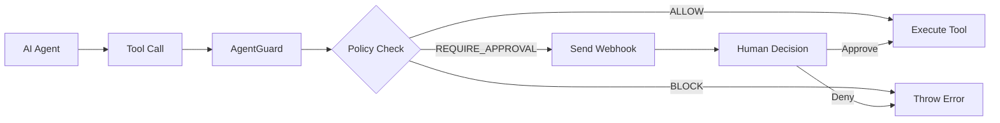

# @zamoore/agentguard-node

A modern security toolkit that gives developers control over their AI agents by intercepting and governing tool calls with declarative policies.

## Overview

**AgentGuard is not another agent framework** — it's a specialized governance layer that makes existing agents safer through declarative policy management.

AgentGuard acts as a security checkpoint between your AI agents and their tools. When an agent wants to call an API, access a database, or perform any action, AgentGuard instantly evaluates that action against your policies and decides whether to allow it, block it, or require human approval.

## 🚀 Key Features

- **🛡️ Declarative Security** - Define rules in simple YAML policies, separate from agent logic
- **⚡ Instant Evaluation** - Real-time policy enforcement with zero-latency decisions
- **👤 Human-in-the-Loop** - Built-in approval workflows with webhook integration
- **🎯 Three Outcomes** - Every tool call is either ALLOWED, BLOCKED, or REQUIRES_HUMAN_APPROVAL
- **🔄 Dynamic Policies** - Hot-reload policies without restarting your application
- **📊 Rich Conditions** - Complex rule matching with priority, regex, nested fields, and more
- **🚀 Modern TypeScript** - Full type safety with ESM/CJS compatibility

## How It Works



1. **Wrap your tools** with AgentGuard protection
2. **Define policies** in YAML to specify allowed/blocked/approval-required actions
3. **AgentGuard intercepts** tool calls and evaluates them against your policies
4. **Three possible outcomes**:
   - **ALLOW**: Tool executes immediately
   - **BLOCK**: Tool call is stopped with an error
   - **REQUIRE_HUMAN_APPROVAL**: Webhook sent, waits for human decision

## Installation

```bash
npm install @zamoore/agentguard-node
# or
pnpm add @zamoore/agentguard-node
# or
yarn add @zamoore/agentguard-node
```

## Quick Start

### 1. Create a Policy File

Create a `policy.yaml` file defining your security rules:

```yaml
version: '1.0'
name: 'Financial Controls'
description: 'Tiered approval system for financial operations'
defaultAction: BLOCK

webhook:
  url: 'https://your-app.com/webhook/approval'
  timeout: 30000

rules:
  - name: 'allow-small-transfers'
    priority: 10
    action: ALLOW
    conditions:
      - field: 'toolCall.toolName'
        operator: 'equals'
        value: 'transfer'
      - field: 'toolCall.parameters.amount'
        operator: 'lte'
        value: 100

  - name: 'require-approval-large-transfers'
    priority: 20
    action: REQUIRE_HUMAN_APPROVAL
    conditions:
      - field: 'toolCall.toolName'
        operator: 'equals'
        value: 'transfer'
      - field: 'toolCall.parameters.amount'
        operator: 'gt'
        value: 100
      - field: 'toolCall.parameters.amount'
        operator: 'lte'
        value: 10000

  - name: 'block-huge-transfers'
    priority: 30
    action: BLOCK
    conditions:
      - field: 'toolCall.toolName'
        operator: 'equals'
        value: 'transfer'
      - field: 'toolCall.parameters.amount'
        operator: 'gt'
        value: 10000
```

### 2. Protect Your Tools

```typescript
import { AgentGuard } from '@zamoore/agentguard-node';

// Initialize AgentGuard
const guard = new AgentGuard({
  policyPath: './policy.yaml',
  enableLogging: true,
});
await guard.initialize();

// Your existing tool functions
async function transfer(params: { amount: number; to: string; from: string }) {
  // Your transfer logic here
  return { transactionId: 'tx-123', ...params };
}

async function readAccount(accountId: string) {
  // Your account reading logic
  return { balance: 1000, accountId };
}

// Wrap tools with AgentGuard protection
const protectedTransfer = guard.protect('transfer', transfer);
const protectedReadAccount = guard.protect('readAccount', readAccount);

// Now your agent calls go through AgentGuard
try {
  // This will be allowed (amount <= 100)
  const result1 = await protectedTransfer({
    amount: 50,
    to: 'user123',
    from: 'agent-account',
  });
  console.log('Small transfer completed:', result1);

  // This will require human approval (100 < amount <= 10000)
  const result2 = await protectedTransfer({
    amount: 5000,
    to: 'vendor456',
    from: 'agent-account',
  });
  console.log('Large transfer completed:', result2);

  // This will be blocked (amount > 10000)
  const result3 = await protectedTransfer({
    amount: 50000,
    to: 'suspicious-account',
    from: 'agent-account',
  });
} catch (error) {
  console.error('Tool call blocked or denied:', error.message);
}
```

### 3. Handle Approval Webhooks

Set up an endpoint to receive approval requests:

```typescript
// Express.js example
app.post('/webhook/approval', async (req, res) => {
  const { request } = req.body;

  console.log('Approval needed for:', {
    toolName: request.toolCall.toolName,
    parameters: request.toolCall.parameters,
    requestId: request.id,
  });

  // Send to your approval system (Slack, dashboard, etc.)
  await sendToApprovalSystem(request);

  res.json({ success: true });
});

// When human makes decision, send response back to AgentGuard
async function handleHumanDecision(requestId: string, approved: boolean, reason?: string) {
  await guard.handleApprovalResponse({
    requestId,
    decision: approved ? 'APPROVE' : 'DENY',
    reason,
    approvedBy: 'manager@company.com',
  });
}
```

## Policy Configuration

### Policy Structure

```yaml
version: '1.0' # Policy version
name: 'My Policy' # Human-readable name
description: '...' # Optional description
defaultAction: BLOCK # ALLOW | BLOCK | REQUIRE_HUMAN_APPROVAL

# Optional webhook for approvals
webhook:
  url: 'https://example.com/webhook'
  timeout: 30000 # Timeout in ms
  retries: 3 # Number of retries
  headers: # Custom headers
    Authorization: 'Bearer token'

rules:
  - name: 'rule-name'
    priority: 100 # Higher = evaluated first
    action: ALLOW # ALLOW | BLOCK | REQUIRE_HUMAN_APPROVAL
    description: '...' # Optional
    conditions:
      - field: 'toolCall.toolName'
        operator: 'equals'
        value: 'myTool'
```

### Condition Operators

| Operator     | Description           | Example                   |
| ------------ | --------------------- | ------------------------- |
| `equals`     | Exact match           | `value: "admin"`          |
| `contains`   | String contains       | `value: "test"`           |
| `startsWith` | String starts with    | `value: "read_"`          |
| `endsWith`   | String ends with      | `value: "_admin"`         |
| `regex`      | Regular expression    | `value: "^[a-z]+$"`       |
| `in`         | Value in array        | `value: ["read", "list"]` |
| `gt`         | Greater than          | `value: 100`              |
| `lt`         | Less than             | `value: 1000`             |
| `gte`        | Greater than or equal | `value: 0`                |
| `lte`        | Less than or equal    | `value: 10000`            |

### Field Paths

Access nested data using dot notation:

```yaml
conditions:
  - field: 'toolCall.toolName' # Tool name
  - field: 'toolCall.parameters.amount' # Parameter value
  - field: 'toolCall.metadata.environment' # Metadata
  - field: 'toolCall.agentId' # Agent ID
  - field: 'toolCall.parameters.user.role' # Nested object
  - field: 'toolCall.parameters.items[0].id' # Array indexing
```

## Advanced Examples

### Environment-Based Policies

```yaml
rules:
  - name: 'dev-permissive'
    action: ALLOW
    conditions:
      - field: 'toolCall.metadata.environment'
        operator: 'equals'
        value: 'development'

  - name: 'production-strict'
    action: REQUIRE_HUMAN_APPROVAL
    conditions:
      - field: 'toolCall.metadata.environment'
        operator: 'equals'
        value: 'production'
      - field: 'toolCall.toolName'
        operator: 'startsWith'
        value: 'write'
```

### Complex Rule Combinations

```typescript
// Protect with metadata
const tool = guard.protect('databaseWrite', writeToDatabase, {
  agentId: 'agent-123',
  sessionId: 'session-456',
  metadata: {
    environment: 'production',
    user: { role: 'admin', verified: true },
  },
});
```

### Multiple Policies

```typescript
// Different policies for different environments
const devGuard = new AgentGuard({ policyPath: './policies/dev.yaml' });
const prodGuard = new AgentGuard({ policyPath: './policies/prod.yaml' });

await Promise.all([devGuard.initialize(), prodGuard.initialize()]);

const guard = process.env.NODE_ENV === 'production' ? prodGuard : devGuard;
```

## API Reference

### `AgentGuard`

#### Constructor

```typescript
new AgentGuard(config: AgentGuardConfig)
```

**Config Options:**

```typescript
type AgentGuardConfig = {
  // Policy source (choose one)
  policyPath?: string; // Path to YAML policy file
  policy?: Policy; // Inline policy object

  // Optional configuration
  webhook?: WebhookConfig; // Override policy webhook
  enableLogging?: boolean; // Enable/disable logging (default: true)
  timeout?: number; // Approval timeout in ms (default: 30000)
  cache?: {
    enabled: boolean; // Enable policy caching
    ttl?: number; // Cache TTL in ms
  };
};
```

#### Methods

##### `initialize()`

```typescript
await guard.initialize(): Promise<void>
```

Load and validate the policy. Must be called before using `protect()`.

##### `protect()`

```typescript
guard.protect<T>(
  toolName: string,
  toolFunction: T,
  options?: {
    agentId?: string;
    sessionId?: string;
    metadata?: Record<string, unknown>;
  }
): WrappedTool<T>
```

Wrap a tool function with policy enforcement.

##### `handleApprovalResponse()`

```typescript
await guard.handleApprovalResponse(response: ApprovalResponse): Promise<void>

type ApprovalResponse = {
  requestId: string;
  decision: 'APPROVE' | 'DENY';
  reason?: string;
  approvedBy?: string;
};
```

Process approval/denial from external system.

##### `reloadPolicy()`

```typescript
await guard.reloadPolicy(): Promise<void>
```

Reload policy from file (only works with `policyPath`, not inline policies).

##### `getPolicy()`

```typescript
guard.getPolicy(): Policy | null
```

Get the currently loaded policy.

## Error Handling

AgentGuard throws specific error types:

```typescript
import {
  PolicyViolationError,
  ApprovalTimeoutError,
  PolicyLoadError,
} from '@zamoore/agentguard-node';

try {
  await protectedTool();
} catch (error) {
  if (error instanceof PolicyViolationError) {
    console.log('Blocked by policy:', error.rule.name);
  } else if (error instanceof ApprovalTimeoutError) {
    console.log('Approval timed out');
  }
}
```

## Logging

AgentGuard provides structured logging:

```typescript
const guard = new AgentGuard({
  policyPath: './policy.yaml',
  enableLogging: true, // Enable detailed logs
});

// Logs include:
// - Policy evaluations
// - Rule matches/misses
// - Approval requests
// - Tool call outcomes
```

## Development

This project uses modern tooling:

### Prerequisites

- Node.js 18+
- pnpm 8+

### Setup

```bash
# Install dependencies
pnpm install

# Build the package
pnpm build

# Run tests
pnpm test

# Run integration tests
pnpm test:integration

# Check test coverage
pnpm test:coverage

# Lint and format
pnpm lint
pnpm format
```

### Project Structure

```
├── src/
│   ├── index.ts              # Main exports
│   ├── types.ts              # Type definitions
│   └── lib/
│       ├── agentguard.ts     # Core AgentGuard class
│       ├── policy-loader.ts  # YAML policy loading
│       ├── hitl-manager.ts   # Human-in-the-loop workflow
│       └── logger.ts         # Structured logging
├── tests/
│   ├── unit/                 # Unit tests
│   ├── integration/          # Integration tests
│   └── fixtures/             # Test data
└── policies/                 # Example policies
```

## Use Cases

- **Financial Services**: Multi-tier approval for transactions
- **Data Access**: Role-based database operation controls
- **API Management**: Rate limiting and permission enforcement
- **Development Workflows**: Environment-specific restrictions
- **Compliance**: Audit trails and approval workflows
- **Security**: Preventing unauthorized or dangerous operations

## Why AgentGuard?

Unlike agent frameworks that provide building blocks, AgentGuard focuses specifically on governance:

✅ **Centralized Security** - All security rules in one place  
✅ **Non-Intrusive** - Works with any agent framework or custom code  
✅ **Declarative** - Policies are configuration, not code  
✅ **Auditable** - Clear rules that non-developers can understand  
✅ **Hot-Reloadable** - Update security without restarts  
✅ **Battle-Tested** - Production-ready with comprehensive test coverage

## License

MIT © [Zack Moore](https://github.com/zamoore)

## Contributing

1. Fork the repository
2. Create your feature branch (`git checkout -b feature/amazing-feature`)
3. Make your changes
4. Run tests (`pnpm test`)
5. Commit your changes (`git commit -m 'Add amazing feature'`)
6. Push to the branch (`git push origin feature/amazing-feature`)
7. Open a Pull Request

Please make sure to update tests as appropriate and follow the existing code style.
